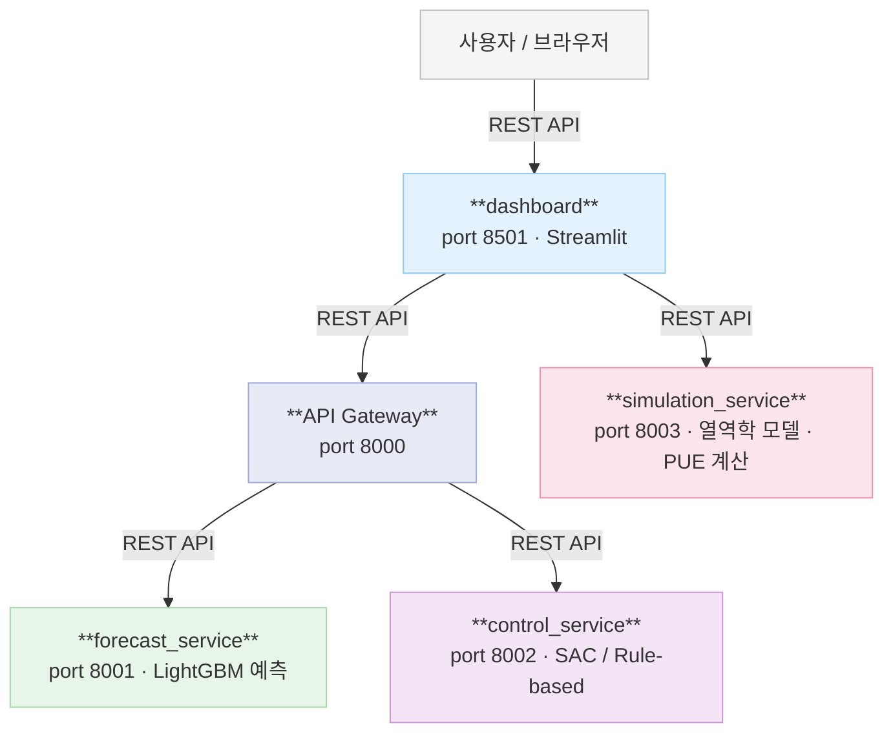

# 시스템 아키텍처

## 서비스 구성

| 서비스 | 포트 | 역할 |
|---|---|---|
| Dashboard | 8501 | Streamlit UI — 시뮬레이션 파라미터 조작, ESG/PUE 시각화 |
| API Gateway | 8000 | 제어·예측 요청 라우팅 (프록시) |
| Forecast Service | 8001 | LightGBM / LSTM 기반 IT 부하 예측 |
| Control Service | 8002 | Rule-based / PID / RL 냉각 제어 |
| Simulation Service | 8003 | 열역학 모델 기반 24h 시뮬레이션, PUE 계산 |
| RL Service | — | PPO / SAC 오프라인 학습 (profile: rl) |

---

## 서비스 연결도



---

## API 엔드포인트

### API Gateway (8000)
| Method | Path | 설명 |
|---|---|---|
| GET | `/health` | 헬스체크 |
| POST | `/api/v1/control/optimize` | Rule-based 최적 제어 |
| POST | `/control/rule-based` | Rule-based 제어 |
| POST | `/control/rl` | RL 에이전트 제어 |
| POST | `/api/v1/forecast` | IT 부하 예측 |

### Simulation Service (8003)
| Method | Path | 설명 |
|---|---|---|
| GET | `/health` | 헬스체크 |
| POST | `/api/v1/simulation/calculate` | 단일 포인트 열역학 계산 |
| POST | `/api/v1/simulation/24h` | 24시간 시뮬레이션 |

### Forecast Service (8001)
| Method | Path | 설명 |
|---|---|---|
| GET | `/health` | 헬스체크 (model_ready 포함) |
| POST | `/api/v1/forecast` | LightGBM / LSTM 예측 |

### Control Service (8002)
| Method | Path | 설명 |
|---|---|---|
| GET | `/health` | 헬스체크 |
| POST | `/api/v1/control/optimize` | 최적 제어 |
| POST | `/esg/summary` | 탄소·비용 요약 |

---

## 데이터 흐름

### 대시보드 시뮬레이션
```
사용자 (파라미터 변경)
  → Dashboard
  → Simulation Service POST /api/v1/simulation/24h
  → 열역학 계산 (IT전력 → 냉각부하 → 칠러전력 → PUE)
  → DataFrame 반환
  → ESG 계산 (탄소 / 비용 / CUE)
  → 차트 렌더링
```

> Simulation Service 미기동 시 Dashboard가 domain 함수로 직접 계산 (fallback)

### 제어 요청
```
Dashboard
  → API Gateway POST /api/v1/control/optimize
  → Control Service (Rule-based / RL 추론)
  → 제어 응답 (cooling_mode, supply_air_temp_setpoint_c, expected_pue)
```

### RL 학습 (오프라인)
```
docker compose run --rm rl-service
  → IDCEnv (커스텀 열역학 환경, 한국 기후 기반)
  → PPO / SAC 학습
  → data/models/{run-name}.zip 저장
```
